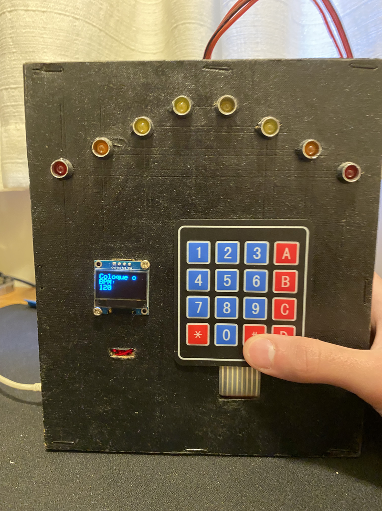
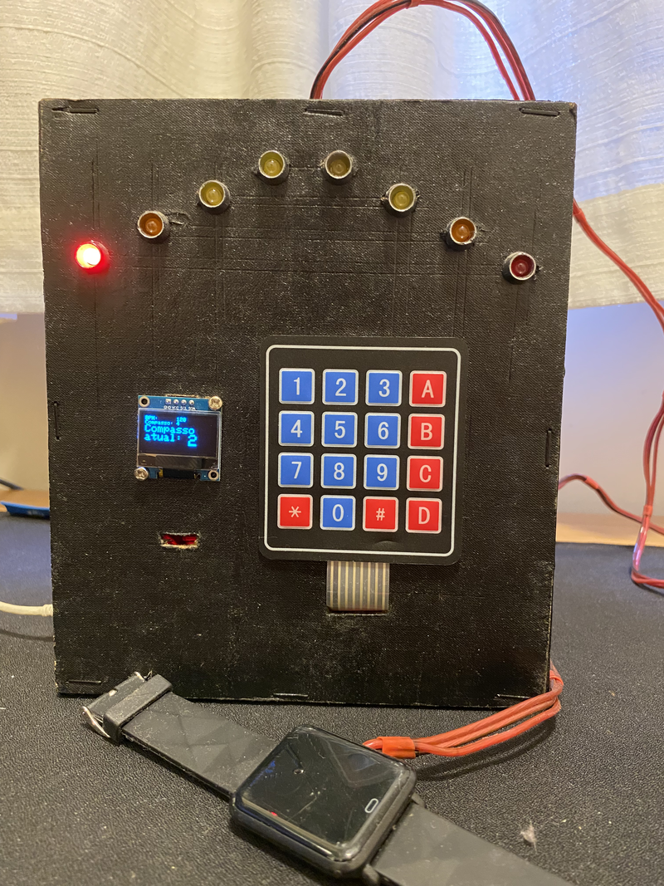
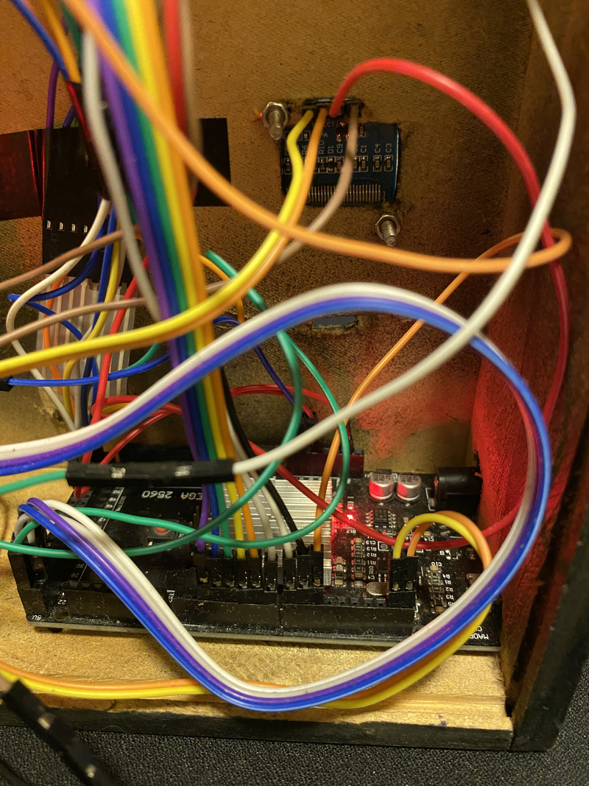

# Mechanical-Style Arduino Metronome

This repository contains an Arduino-based metronome I built for my sister. It emulates the sound and feel of a mechanical metronome by using a 4-relay module for click sounds, a vibration motor attached to an old wristwatch for tactile feedback, and a row of LEDs for visual beats. The user enters BPM and the time signature (beat divisions) on a 12-key membrane keypad and the device keeps the relays, LEDs and vibration synchronized.

## Features

- Mechanical 'click' sound using a 4-channel relay board to approximate the sound of a wind-up metronome.
- Tactile feedback using a vibration motor mounted to an old watch so you can feel each beat.
- Visual beat indicator using 8 LEDs that sweep back-and-forth in time with the metronome.
- Input via 12-key membrane matrix keypad (enter BPM and time signature).
- OLED 128x64 (I2C) display for BPM, current beat and status messages.
- Simple interface: enter numbers on keypad, press `#` to confirm, `A`/`B` to adjust BPM by +5/-5, and `*` to re-enter settings.

## Bill of Materials (what I used)

- Arduino Mega (any compatible Arduino with sufficient I/O pins should work)
- 4-channel relay module
- 12-key membrane matrix keypad (4x3 mapped into a 4x4 Keypad library layout)
- OLED 128x64 I2C display (0.96", address 0x3C)
- Vibration motor / Vibracall module
- LEDs (I used 2 red, 2 orange, 4 yellow — any colors work)
- Misc wires, resistors (for LEDs if needed), and a small enclosure or old watch case for the vibration motor

See the `Images/` folder for photos of the assembled device.

## Final Product

  

  

  

  

## Pinout (as used in the code)

These pin assignments match `Metronomo.ino` and can be changed in the source if you need different pins:

- OLED: I2C (SDA/SCL) — uses default Wire pins for your board; OLED address 0x3C in the code
- Keypad rows: pins 9, 8, 7, 6
- Keypad cols: pins 5, 4, 3, 2
- LEDs (8): pins 51, 50, 49, 48, 47, 46, 45, 44
- Relays (4): pins 22, 23, 24, 25
- Vibration motor: pin 10

If you use a smaller Arduino (Uno), adapt the pins to available digital I/O and adjust the code accordingly.

## How it works (high level)

1. On power-up the OLED shows a welcome message and then prompts the user to enter BPM and then the time signature (numerator). The keypad numeric entries are accepted until `#` is pressed.
2. The device calculates the interval per beat from BPM and divides each beat into sub-steps to sequence LEDs and to time the relay "clicks" and vibration pulses so they feel/appear synchronous.
3. The relays are toggled in a pattern to create an audible clicking sound similar to a mechanical escapement. The vibration motor is activated briefly at the start of each beat for tactile feedback. LEDs sweep left/right following the beat.
4. Pressing `A` increases BPM by 5, `B` decreases BPM by 5, and `*` re-enters BPM/time signature setup mode.

## Software / Libraries

You will need the following Arduino libraries (available via Library Manager or GitHub):

- Keypad (https://github.com/Chris--A/Keypad)
- Adafruit GFX (https://github.com/adafruit/Adafruit-GFX-Library)
- Adafruit SSD1306 (https://github.com/adafruit/Adafruit_SSD1306)

Install them in the Arduino IDE (Sketch → Include Library → Manage Libraries...) before compiling.

## Uploading

1. Open `Metronomo.ino` with the Arduino IDE.
2. Select the correct board (e.g. Arduino Mega) and port.
3. Verify and upload.

## Usage

- When prompted, type the BPM using the keypad and press `#`.
- Then type the time signature numerator (the number of beats per bar) and press `#`.
- The metronome starts automatically.
- Adjust BPM quickly with `A` (increase +5) and `B` (decrease -5).
- Press `*` to re-enter BPM/time signature.
